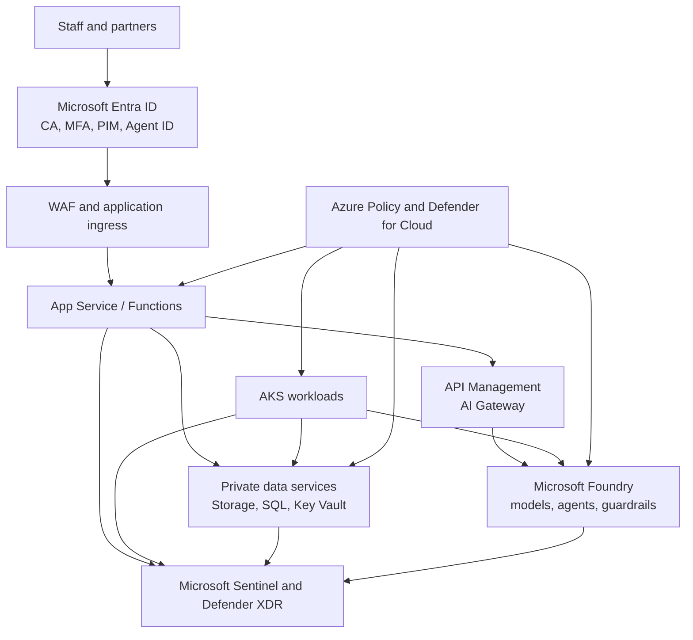

# Target architecture

## Logical design

## Subscription and resource organization

The lab uses one subscription because the promotional credit is attached to one account. A production design would normally separate platform, production, nonproduction, and security-monitoring subscriptions under management groups.

| Resource group | Purpose | Lifetime |
|---|---|---|
| `rg-sc500-core-cc` | shared network, identities, DNS | Days 1-30 |
| `rg-sc500-data-cc` | Storage, Key Vault, SQL | Days 8-30 |
| `rg-sc500-app-cc` | App Service, Functions, Logic Apps | Days 13-30 |
| `rg-sc500-vm-cc` | VM, Bastion/JIT test | Days 14-15 |
| `rg-sc500-aks-cc` | ACR and AKS burst environment | Days 16-18 |
| `rg-sc500-ai-eus2` | synthetic Foundry and APIM AI tests | Days 21-26 |
| `rg-sc500-sec-cc` | Log Analytics, Sentinel, automation | Days 1-30 |

`cc` means Canada Central and `eus2` means East US 2. Names in the actual lab include a short unique suffix where global uniqueness is required.

## Network design

| Network | CIDR | Subnets |
|---|---|---|
| Hub | `10.20.0.0/16` | `AzureFirewallSubnet 10.20.0.0/26`, `AzureBastionSubnet 10.20.1.0/26`, `snet-shared 10.20.2.0/24` |
| App spoke | `10.21.0.0/16` | `snet-app 10.21.1.0/24`, `snet-integration 10.21.2.0/24`, `snet-private-endpoints 10.21.3.0/24` |
| AKS spoke | `10.22.0.0/16` | `snet-aks 10.22.1.0/23` |

The lab creates peering and security rules first. Azure Firewall and some gateway services are brief cost-burst exercises and are deleted during the same session. Private endpoint DNS zones are linked only to networks that require resolution.

## Identity boundaries

- Human administrators use separate admin identities, passwordless MFA, PIM, and Conditional Access.
- Applications use system-assigned or user-assigned managed identities.
- AKS pods use Microsoft Entra Workload ID and federated credentials.
- Each identity receives the narrowest data-plane role at the resource scope.
- Management-plane roles do not imply data-plane access to Key Vault, Storage, or SQL.
- Emergency access accounts are excluded from Conditional Access only after alerting and monitoring are documented.

## Data security

| Data | Service | Control choice |
|---|---|---|
| Resume and attachment objects | Blob Storage | Entra authorization, private endpoint, versioning/soft delete, Defender for Storage, malware-scan limit |
| Shared file workflow | Azure Files | Microsoft Entra Kerberos evaluation with cloud-only identities where supported |
| Structured case records | Azure SQL Database | Entra admin, firewall/private access, TDE, auditing, Defender for SQL, Always Encrypted decision |
| Secrets and encryption keys | Key Vault | Azure RBAC, private endpoint/firewall, soft delete, purge protection, rotation policy, Defender for Key Vault |
| AI prompts and test documents | Foundry project | synthetic only outside Canada, content filters, Prompt Shields, evaluation, red teaming, AI threat protection |

## Security operations design

High-value security data remains in the Sentinel Analytics tier for detection and hunting. High-volume or long-retention data moves to the Sentinel data lake when it does not require real-time analytics. The design keeps:

- Azure Activity, Defender incidents, and critical identity events in Analytics for 90 days;
- verbose network or application telemetry in the data lake for 13 months;
- selected audit evidence with seven years total retention;
- only small synthetic samples during the POC.

Data in the data lake is not available to every real-time analytics feature. The lab explicitly tests the difference between interactive Analytics queries and data lake KQL jobs.

## AI control layers

| Layer | Control | Purpose |
|---|---|---|
| Data | Purview DSPM and SharePoint exposure review | find overshared sensitive grounding content |
| Identity | Entra Agent ID and Conditional Access for agents | inventory, constrain, and investigate agent identities |
| Build | Foundry roles, managed identity, guardrails | protect the project and model/agent interaction points |
| Test | Foundry evaluations and AI Red Teaming Agent | measure quality, safety, jailbreak, and groundedness risk before release |
| Gateway | API Management AI Gateway | central authentication, quotas, token policies, backend routing, and logging |
| Runtime | Defender for AI Services and Copilot Studio real-time protection | detect prompt attacks and anomalous runtime behavior |
| Posture | Defender Data and AI security dashboard | unify AI inventory, recommendations, attack paths, and alerts |
| Operations | Sentinel, Defender XDR, Security Copilot | investigate, automate, and communicate response |

## Deliberate compromises

- East US 2 is used for specialized AI exercises only with synthetic data. This meets the learning requirement without pretending the test is a production residency design.
- Azure Firewall, gateways, VM, and AKS resources are ephemeral. The production decision would require load and availability testing.
- The lab does not create AWS or GCP accounts. It walks through connector prerequisites and produces a design record for multicloud onboarding.
- Microsoft 365 AI administration is completed through an eligible trial when offered; otherwise, it uses a guided simulation and an evidence-based configuration plan.

